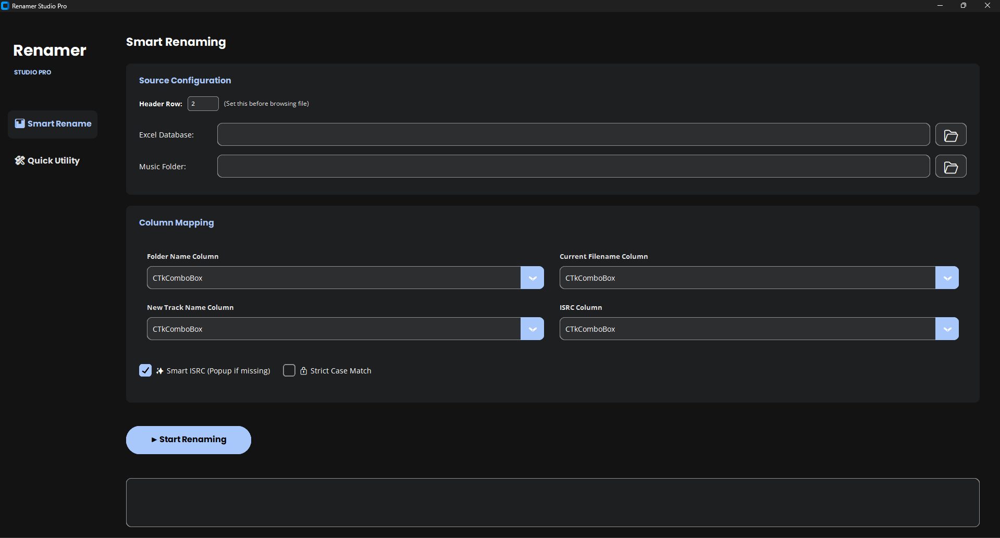
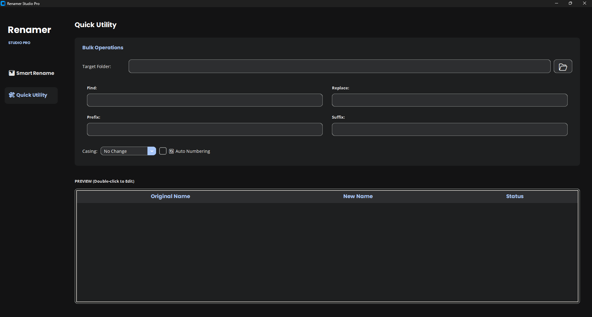

# 🎵 Renamer Studio Pro (Midnight Edition)


A powerful, modern, and aesthetically pleasing bulk file renaming tool designed specifically for Audio Engineers and Music Data Managers. It features a **Dual-Mode** system: Data-driven renaming via Excel/CSV and a standard Utility mode for quick pattern edits.

> **Theme:** "Midnight Purple" (Deep Ocean & Neon Violet Aesthetic)

---

## ✨ Key Features

### 🚀 1. Smart Rename (Excel Mode)
* **Database Driven:** Renames `.wav` (or other) files based on rows in an Excel (`.xlsx`) or CSV file.
* **Intelligent Mapping:** Automatically detects and allows mapping of columns for *Folder Name*, *Current Filename*, *New Track Name*, and *ISRC*.
* **Smart ISRC Injection:**
    * Appends ISRC codes to filenames automatically from the Excel sheet.
    * **Interactive Fallback:** If an ISRC is missing in the Excel, the app pauses and asks you to enter it manually (once per folder), saving it to a cache.
* **Strict Case Match:** Toggle switch to ensure file matching respects exact capitalization (e.g., distinguishing `Song.wav` from `song.wav`).

### 🛠 2. Quick Tools (Utility Mode)
* **Find & Replace:** Standard string substitution.
* **Prefix & Suffix:** Add text to the start or end of filenames.
* **Casing Control:** Convert filenames to UPPERCASE, lowercase, or Title Case.
* **Sequential Numbering:** Automatically append `_001`, `_002`, etc.

### 🎨 3. Modern UI/UX (2025 Design)
* **Custom Graphics Engine:** Uses a custom-written rendering engine for smooth Rounded Corners (Pill-shaped buttons, Floating cards).
* **Dark Mode:** A "Matte Carbon & Midnight Purple" palette (`#070F2B`, `#1B1A55`) designed to reduce eye strain.
* **Live Preview:** See the "Old Name" vs. "New Name" in a table before clicking Apply.

---

## 📸 Screenshots

*(Add screenshots of your app here. Save images in your repo and link them like below)*

| **Excel Mode** | **Utility Mode** |
|:---:|:---:|
| ![Excel Mode Screenshot] | ![Utility Mode Screenshot] |

---

## ⚙️ Installation

### Option 1: Run as Executable (No Python Required)
1.  Download the latest `RenamerStudio.exe` from the [Releases](#) page.
2.  Double-click to run. No installation required.

### Option 2: Run from Source (For Developers)
**Prerequisites:**
* Python 3.8 or higher.

**Steps:**
1.  Clone this repository:
    ```bash
    git clone [https://github.com/your-username/Renamer-Studio-Pro.git](https://github.com/your-username/Renamer-Studio-Pro.git)
    cd Renamer-Studio-Pro
    ```
2.  Install required libraries:
    ```bash
    pip install pandas openpyxl
    ```
    *(Note: `tkinter` usually comes pre-installed with Python).*
3.  Run the script:
    ```bash
    python RenamerStudio.py
    ```

---

## 📖 Usage Guide

### 📂 Mode A: Excel Renaming
This mode is best when you have a spreadsheet containing your metadata.

1.  **Select Files:**
    * **Excel Database:** Select your `.xlsx` or `.csv` file.
    * **Music Folder:** Select the root folder containing your audio files (or parent folders).
2.  **Map Columns:**
    * The app tries to auto-detect columns. Ensure the dropdowns match your data (e.g., "Folder Name", "File Name", "English Track Name").
3.  **Configure Options:**
    * **Smart ISRC:** Check this to be prompted if an ISRC is missing.
    * **Strict Case Match:** Check this if you have files with identical names but different casing.
4.  **Run:** Click **Run Rename**. The log below will show the status of every file.

### 🛠 Mode B: Quick Utility
This mode doesn't need an Excel file. Use it for quick cleanups.

1.  **Select Target Folder.**
2.  **Set Rules:** Type in "Find/Replace" text or "Prefix/Suffix".
3.  **Preview:** The table updates instantly as you type.
4.  **Apply:** Click **Apply Changes** to commit the rename.

---

## 🏗 How to Build (.exe)

If you want to compile this script into a standalone `.exe` file yourself:

1.  Install PyInstaller:
    ```bash
    pip install pyinstaller
    ```
2.  Run the build command:
    ```bash
    python -m PyInstaller --noconsole --onefile --name="RenamerStudio" RenamerStudio.py
    ```
3.  The executable will appear in the `dist` folder.

---

## 📦 Dependencies

* [Python](https://www.python.org/)
* [Pandas](https://pandas.pydata.org/) (Data manipulation)
* [OpenPyXL](https://openpyxl.readthedocs.io/) (Excel support)
* [Tkinter](https://docs.python.org/3/library/tkinter.html) (Standard GUI)

---

## 📄 License

This project is licensed under the MIT License - see the [LICENSE](LICENSE) file for details.

---

**Made with ❤️ using Python.**